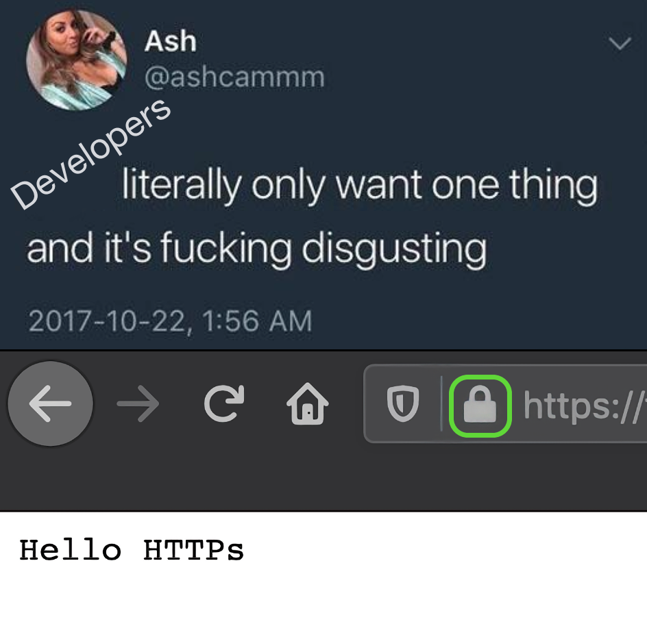

# MinimalPlugHttps

This is a minimal project for using Plug and Cowboy to serve content over HTTPS. 



## Generating Certs

In order for this to work, you will need a domain name pointing at a server. Cowboy does support self-signed certs and you could set it up using one, but the goal is to set you up so you can get that sweet, sweet lock icon in your browser.

I use [Namecheap](https://www.namecheap.com/) because I like them and they give free privacy guards on registrations. I also think [Digital Ocean](https://www.digitalocean.com/) makes setting up servers quite easy. However, there's nothing special about these providers and anyone who will give you a machine you can `ssh` into will be fine!

One you have a domain name and a server, you can use [certbot](https://certbot.eff.org/) to [get a certificate quite easily](https://certbot.eff.org/instructions). Once you complete the process you will see a message like this:

```
 Congratulations! Your certificate and chain have been saved at:
   /etc/letsencrypt/[...]/fullchain.pem
   Your key file has been saved at:
   /etc/letsencrypt/[...]/privkey.pem
   Your cert will expire on ...
```

These paths are important because we need to pass them to cowboy so it can provide them to clients. Certbot conviently prints the full paths after creating the certificates, but they can also be found in `/etc/letsencrypt.` Starting with `/etc/letsencrypt/live` all the folders are owned by root so be sure to use `sudo` if you need to access the files!

## Getting Online

`minimal_plug_https.ex` has three strings in the format `"/etc/letsencrypt/[...]/cert.pem"`. Replacing the `[...]` with the path for your own certs is all you need to do!

This will produce a working https server:

`sudo mix app --no-halt`

and then navigate a web browser to `https://[your.domain]/` to see the hello HTTPs page.
